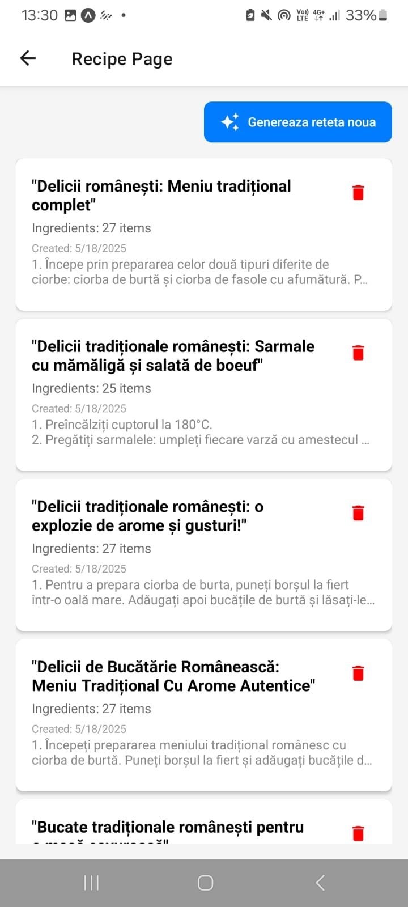

# CoolSave

CoolSave is a mobile app built with Expo that helps you **track food expiration, generate recipes from your fridge contents, and reduce waste efficiently**.

> **🏆 First Place Winner at Tech Venture Hackathon 2025**

## Screenshots

**Food Page**


**Recipe Page**



## Features

- Live **temperature and humidity tracking** (via sensors)
- **Food management with expiration alerts**
- **Expired food statistics with top category tracking**
- **Auto-generated recipes** based on available food
- Edit, add, and manage products with an intuitive UI
- Fast **Expo Router navigation** with clean structure

## Backend

CoolSave uses a dedicated backend for sensors, food management, and recipe generation:

[CoolSave_API](https://github.com/andreicosmin02/CoolSave_API)

Ensure your backend is running locally or remotely and the environment variable `EXPO_PUBLIC_API_URL` is set accordingly.

## Getting Started

1. **Install dependencies:**

    ```
    npm install
    ```

2. **Run the app:**

    ```
    npx expo start
    ```

3. **Environment setup:**

    Create a `.env` file in the root:

    ```
    EXPO_PUBLIC_API_URL=http://localhost:3000/
    ```

    Adjust the URL based on your backend location.

## Project Structure

- `app/(app)/food` - Add, edit, view, and manage food products
- `app/(app)/recipe` - Generate and manage recipes
- `app/(app)/home` - Dashboard with sensor readings and food stats
- `components/InfoBox.tsx` - Clean reusable UI for displaying stats
- Integrated REST endpoints:
    - `/api/food-products`
    - `/api/recipe`
    - `/api/sensors/latest`

## Tech Stack

- **React Native (Expo)**
- **Expo Router**
- **TypeScript**
- **REST API Integration**
- **Clean component architecture**

## Contributing

We built CoolSave to help reduce waste and make fridge management smarter. Feel free to open issues or pull requests to improve features, fix bugs, or extend functionality.
